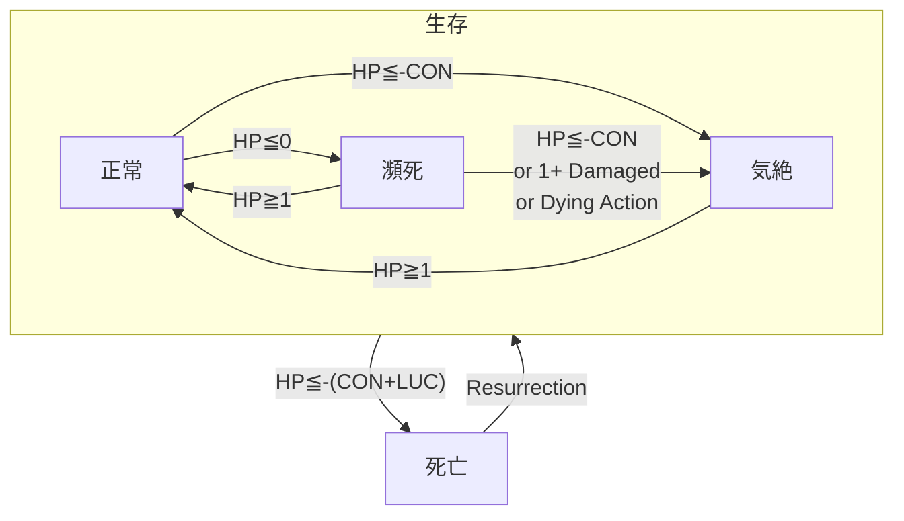

# HPとダメージのルール

- このドキュメントでは、ダメージを与えた/受けた際のルールと、HPが尽きた際のルールについて解説します
- 戦闘のルールとして記載していますが、冒険中に生じるダメージは、このドキュメントのルールに準じて処理されます

---

## ダメージの適用ルール

- キャラクターがダメージを受けるとき、下記の順序でそのダメージを適用する

$$
障壁 (魔法や奇跡により得られるシールド) → 装甲 (防具の耐久力) → HP (キャラクターの耐久力)
$$

---

### HP / Hit Point

- そのキャラクターの耐久力
    - 詳細は [../02-player-character/01-status.md](../02-player-character/01-status.md) を参照すること
- HPが0点以下になると、そのキャラクターは瀕死状態となったり、気絶したり、死亡する

---

### 装甲

- 防具の耐久力
- ダメージを受けるとき、HPの代わりに減少する
    - HPのバッファとして機能する数値である
- 装甲が0点になっても、その防具の防護点や回避点は有効

---

### 障壁

- 魔法や奇跡の効果により得られる、バリアやシールド
- ダメージを受けるとき、HPと装甲の代わりに減少する
    - HPや装甲よりも優先して消費する数値である
- スペルの効果により得られるが、有効時間が存在する

障壁の重ねがけ:
- 障壁は重ねがけすることができる
- 点数は現在の障壁の数値に加算される
- 持続ラウンドは、新しく付与された効果の値が現在の残りラウンドより長ければ上書きし、短ければ現状を維持する
- 同じ名前のアイテムや魔法の効果から、重複して効果を受けることができる
    - 「シールド」の魔法によって障壁を得ている状態でさらに「シールド」を使用すると、障壁の点数はさらに加算される

---

## 瀕死 / 気絶 / 死亡

- キャラクターのHPが0以下になったとき、そのキャラクターは瀕死状態になる
    - 瀕死状態で自身のターンを迎えると、1度だけ瀕死行動ができる
    - 瀕死状態で自身のターンを終了すると、そのキャラクターは気絶する
    - 瀕死状態で1点でもダメージを受けると、そのキャラクターは気絶する
    - HPが1以上に回復した場合、瀕死状態は解除され、戦闘に復帰する
- HPが-CON点以下になったとき、そのキャラクターは瀕死状態を経由せず、気絶する
    - HPが-(CON+LUC)点以下になったとき、そのキャラクターは死亡する
    - HPが1以上に回復した場合、気絶状態は解除され、戦闘に復帰する
- HPが-(CON+LUC)点以下になったとき、そのキャラクターは即座に死亡する
    - 死亡したキャラクターは、何かしらの蘇生手段によってのみ戦闘に復帰する
- 正常/瀕死/気絶/死亡の状態遷移は、下記のように行われる

---

### 瀕死 / 気絶 / 死亡の遷移の例

CON3、LUC2、HP6のキャラクターの例:
- HP6の状態で4点のダメージを受け、HP2になった → そのまま戦闘続行可能
- HP2の状態で3点のダメージを受け、HP-1になった → 瀕死状態に陥る
- HP-1の瀕死状態で、自身の手番になった → 1回の瀕死行動を実行し、その後に気絶する
- HP-1の気絶状態で味方からHPを2点回復してもらった → HP1となり、戦闘に復帰
- HP1の状態で4点のダメージを受け、HP-3になった → 気絶状態に陥る
- 気絶した状態で2点のダメージを受け、HP-5になった → 死亡する

---

### 瀕死 / 瀕死行動

- キャラクターのHPが0以下になったとき、そのキャラクターは瀕死状態になる
- 瀕死状態では、キャラクターは自身のターンで、下記の瀕死行動を、行動扱いとして1回だけ行うことができる
    - 基本的には予備行動で可能な行為ができるが、移動などの一部の行為はできない

| 瀕死行動                       | 内容                                                       |
| :----------------------------- | :--------------------------------------------------------- |
| ポーション/スクロールの使用    | 携行しているポーション/スクロールを使用する                |
| 「予備行動可」のスペルの行使   | 予備行動として行使可能なスペルは、瀕死状態でも行使できる   |
| 「予備行動可」のアイテムの使用 | 予備行動として行使可能なアイテムは、瀕死状態でも行使できる |
| その他                         | GMと相談のうえ、上記に当てはまらない瀕死行動を実行する     |

- 瀕死状態で自身のターンを終えたキャラクターは、気絶する
- 瀕死状態でHPが1点以上に回復した場合、そのキャラクターは戦闘に復帰できる

> 戦闘復帰の扱い:
> - 起き上がるために行動や予備行動を消費する、というルールはない
> - 復帰後のターンと行動の処理は、通常のルールに従う
> - 瀕死になる前からすでに行動済のラウンドでは、復帰後に行動することはできない
> - 瀕死行動は「行動扱い」として実行するため、瀕死行動によって起き上がったターンでは行動ができない
> - 瀕死行動で起き上がったターンで予備行動を実行していなければ、復帰後に予備行動を実行しても良い
>     - 例: 敵ターンの攻撃によって瀕死となり、自陣ターンの瀕死行動でポーションを飲んで復帰した場合、予備行動を実行できる
>     - 例: 自身の予備行動での自傷ダメージで瀕死となり、瀕死行動でポーションを飲んで復帰した場合、予備行動は実行できない
> 
> 瀕死の扱い:
> - 本来は気絶する状態だが、その一歩手前で耐えている状態
> - 意識を手放す前のほんの僅かな間だけ、なんとか身体を動かすことができる

---

### 気絶

- HPが-CON点以下になったとき、そのキャラクターは瀕死状態を経由せず、気絶する
- 瀕死状態で自身のターンを終了すると、そのキャラクターは気絶する
- 瀕死状態で1点でもダメージを受けると、そのキャラクターは気絶する
- 気絶したキャラクターは行動不可となる
- 気絶したキャラクターへの攻撃は、対象の防護を無視できる
- 同じエリアにいる気絶したキャラクターの携行品を、行動を消費することで奪うことができる
- HPが-CONx2点以下になったとき、そのキャラクターは死亡する
- 気絶状態でHPが1点以上に回復した場合、そのキャラクターは戦闘に復帰できる

> 気絶の扱い:
> - 戦闘不能状態であり、全滅の定義上では、実質的な死亡として扱われる
> - 全滅時に気絶中のPCは、敵陣営によって殺される、連れ去られる、捨て置かれるといった結末を迎える
> - キャラクターは気絶状態から自力で復帰することはできないが、GMの裁量で復帰させても良い
>     - 例: HP0で気絶し、川下に流されていったが、奇跡的に一命をとりとめて起き上がる
>     - 通常のセッションの進行上では、起き上がる際には誰かの介助によっての回復措置を必要とすること

---

### 死亡

- HPが-(CON+LUC)点以下になったとき、そのキャラクターは死亡する
- 死亡したキャラクターは、何かしらの蘇生手段によってのみ戦闘に復帰する
- 蘇生されなかったキャラクターは、ロストとなる
- 何かしらの理由で死亡しているキャラクターのHPを参照する必要がある場合は、-(CON+LUC)点として扱う

> 死亡の条件:
> - HPのマイナス値がCONを上回ることで、肉体的には死の条件を満たす
> - 幸運は、その者を死から遠ざける

---

### エネミーの瀕死/気絶/死亡の処理について

- HPが0点以下になったエネミーは、GMの判断で、瀕死を経ずに気絶したものとしても良い
- この場合、戦闘終了後にPCがトドメを差したものとして扱って良い
- PLが希望する場合、気絶したエネミーにトドメを刺さなかったことにしても良い
- HPが死亡の条件を満たしたエネミーは、PLの希望に関わらず、そのエネミーは死亡する
    - 例:CON2のエネミーに大ダメージを与え、HP-5まで減らした場合、そのエネミーは即座に死亡する

> GM向け:
> - 多くのセッションでは、PCのHPが0以下になるケースより、エネミーのHPが0以下になるケースが大多数である
> - ゴブリンやラージラットにまで瀕死行動を取らせていると、ゲームのテンポを阻害する
> - 基本的にはPC向けのルールとし、エネミーについては強敵との戦いだけ瀕死行動をさせる、といった使い分けをすると良い
